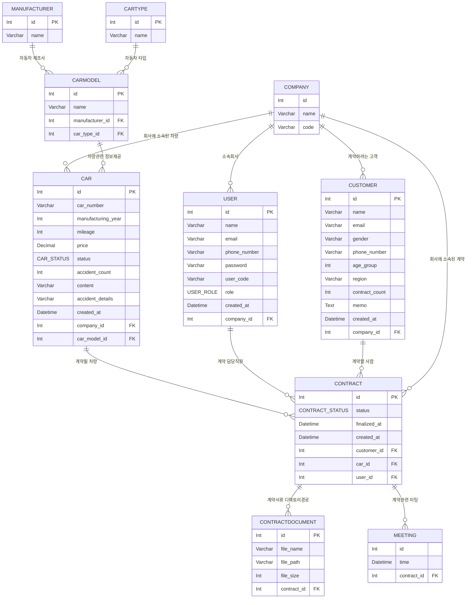

```mermaid
erDiagram
USER {
  Int id PK
  Varchar name
  Varchar email
  Varchar phone_number
  Varchar password
  Varchar user_code
  USER_ROLE role
  Datetime created_at
  Int company_id FK
}
%% ENUM TYPE: USER_ROLE
%% VALUES: ADMIN, OWNER, EMPLOYEE

CUSTOMER{
  Int id PK
  Varchar name
  Varchar email
  Varchar gender
  Varchar phone_number
  Int age_group
  Varchar region
  Int contract_count
  Text memo
  Datetime created_at
  Int company_id FK
}

CAR{
  Int id PK
  Varchar car_number
  Int manufacturing_year
  Int mileage
  Decimal price
  CAR_STATUS status
  Int accident_count
  Varchar content
  Varchar accident_details
  Datetime created_at
  Int company_id FK
  Int car_model_id FK
}
%% ENUM TYPE: CAR_STATUS
%% VALUES: AVAILABLE, PENDING, SOLD

CONTRACT{
  Int id PK
  CONTRACT_STATUS status
  Datetime finalized_at
  Datetime created_at
  Int customer_id FK
  Int car_id FK
  Int user_id FK
}
%% ENUM TYPE: CONTRACT_STATUS
%% VALUES: VEHICLE_CHECKING, PRICE_CHECKING, CONTRACT_PREPARING, CONTRACT_SUCCESS, CONTRACT_FAILED

CONTRACTDOCUMENT{
  Int id PK
  Varchar file_name
  Varchar file_path
  Int     file_size
  Int contract_id FK
}

MANUFACTURER{
  Int id PK
  Varchar name
}

CARTYPE{
  Int id PK
  Varchar name
}

CARMODEL{
  Int id PK
  Varchar name
  Int manufacturer_id FK
  Int car_type_id FK
}

MEETING{
  Int id
  Datetime time
  Int contract_id FK
}

COMPANY{
  Int id
  Varchar name
  Varchar code
}

    COMPANY ||--o{ USER : "소속회사"
    COMPANY ||--o{ CUSTOMER  : "계약하려는 고객"
    COMPANY ||--o{ CAR : "회사에 소속된 차량"
    CARMODEL ||--o{ CAR : "차량관련 정보제공"
    CAR ||--o{ CONTRACT : "계약될 차량"
    USER ||--o{ CONTRACT : "계약 담당직원"
    CUSTOMER ||--o{ CONTRACT : "계약할 사람"
    COMPANY ||--o{ CONTRACT : "회사에 소속된 계약"
    CONTRACT ||--o{ CONTRACTDOCUMENT : "계약서류 디렉토리경로"
    MANUFACTURER ||--o{ CARMODEL : "자동차 제조사"
    CARTYPE ||--o{ CARMODEL : "자동차 타입"
    CONTRACT ||--o{ MEETING : "계약관련 미팅"

```
