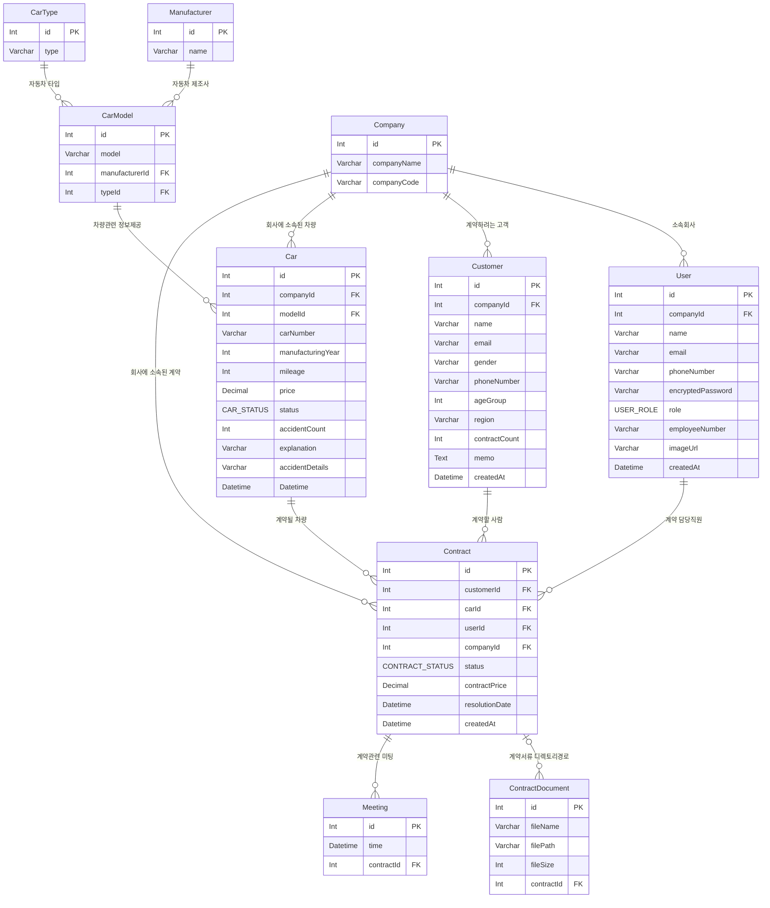

```mermaid
erDiagram
User {
  Int id PK
  Int companyId FK
  Varchar name
  Varchar email
  Varchar phoneNumber
  Varchar encryptedPassword
  USER_ROLE role
  Varchar employeeNumber
  Varchar imageUrl
  Datetime createdAt
}

Customer {
  Int id PK
  Int companyId FK
  Varchar name
  Varchar email
  Varchar gender
  Varchar phoneNumber
  Int ageGroup
  Varchar region
  Int contractCount
  Text memo
  Datetime createdAt
}

Car {
  Int id PK
  Int companyId FK
  Int modelId FK
  Varchar carNumber
  Int manufacturingYear
  Int mileage
  Decimal price
  CAR_STATUS status
  Int accidentCount
  Varchar explanation
  Varchar accidentDetails
  Datetime Datetime
}

Contract {
  Int id PK
  Int customerId FK
  Int carId FK
  Int userId FK
  Int companyId FK
  CONTRACT_STATUS status
  Decimal contractPrice
  Datetime resolutionDate
  Datetime createdAt
}

ContractDocument {
  Int id PK
  Varchar fileName
  Varchar filePath
  Int fileSize
  Int contractId FK
}

Manufacturer {
  Int id PK
  Varchar name
}

CarType {
  Int id PK
  Varchar type
}

CarModel {
  Int id PK
  Varchar model
  Int manufacturerId FK
  Int typeId FK
}

Meeting {
  Int id PK
  Datetime time
  Int contractId FK
}

Company {
  Int id PK
  Varchar companyName
  Varchar companyCode
}

Company ||--o{ User : "소속회사"
Company ||--o{ Customer : "계약하려는 고객"
Company ||--o{ Car : "회사에 소속된 차량"
Company ||--o{ Contract : "회사에 소속된 계약"
CarModel ||--o{ Car : "차량관련 정보제공"
Car ||--o{ Contract : "계약될 차량"
User ||--o{ Contract : "계약 담당직원"
Customer ||--o{ Contract : "계약할 사람"
Contract |o--o{ ContractDocument : "계약서류 디렉토리경로"
Manufacturer ||--o{ CarModel : "자동차 제조사"
CarType ||--o{ CarModel : "자동차 타입"
Contract ||--o{ Meeting : "계약관련 미팅"

```
