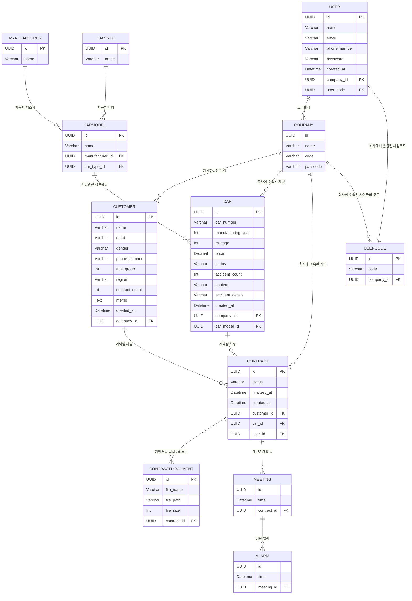

```mermaid

erDiagram
USER {
UUID id PK
Varchar name
Varchar email
Varchar phone_number
Varchar password
Datetime created_at
UUID company_id FK
UUID user_code FK
}

CUSTOMER{
  UUID id PK
  Varchar name
  Varchar email
  Varchar gender
  Varchar phone_number
  Int age_group
  Varchar region
  Int contract_count
  Text memo
  Datetime created_at
  UUID company_id FK
}

CAR{
  UUID id PK
  Varchar car_number
  Int manufacturing_year
  Int mileage
  Decimal price
  Varchar status
  Int accident_count
  Varchar content
  Varchar accident_details
  Datetime created_at
  UUID company_id FK
  UUID car_model_id FK
}

CONTRACT{
  UUID id PK
  Varchar status
  Datetime finalized_at
  Datetime created_at
  UUID customer_id FK
  UUID car_id FK
  UUID user_id FK
}

CONTRACTDOCUMENT{
  UUID id PK
  Varchar file_name
  Varchar file_path
  Int     file_size
  UUID contract_id FK
}

MANUFACTURER{
  UUID id PK
  Varchar name
}

CARTYPE{
  UUID id PK
  Varchar name
}

CARMODEL{
  UUID id PK
  Varchar name
  UUID manufacturer_id FK
  UUID car_type_id FK
}

ALARM{
  UUID id
  Datetime time
  UUID meeting_id FK
}

MEETING{
  UUID id
  Datetime time
  UUID contract_id FK
}

COMPANY{
  UUID id
  Varchar name
  Varchar code
  Varchar passcode
}

USERCODE{
  UUID id PK
  Varchar code
  UUID company_id FK
}

    USER ||--o{ COMPANY : "소속회사"
    USERCODE ||--|| USER : "회사에서 발급된 사원코드"
    COMPANY ||--o{ CUSTOMER  : "계약하려는 고객"
    COMPANY ||--o{ CAR : "회사에 소속된 차량"
    CARMODEL ||--o{ CAR : "차량관련 정보제공"
    CAR ||--o{ CONTRACT : "계약될 차량"
    CUSTOMER ||--o{ CONTRACT : "계약할 사람"
    COMPANY ||--o{ CONTRACT : "회사에 소속된 계약"
    CONTRACT ||--o{ CONTRACTDOCUMENT : "계약서류 디렉토리경로"
    MANUFACTURER ||--o{ CARMODEL : "자동차 제조사"
    CARTYPE ||--o{ CARMODEL : "자동차 타입"
    MEETING ||--o{ ALARM : "미팅 알람"
    CONTRACT ||--o{ MEETING : "계약관련 미팅"
    COMPANY ||--o{ USERCODE : "회사에 소속된 사원들의 코드"

```
